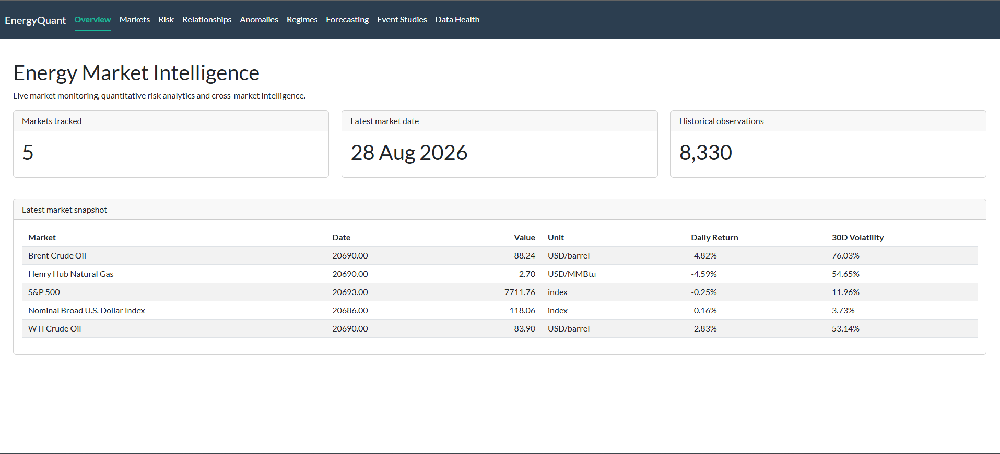
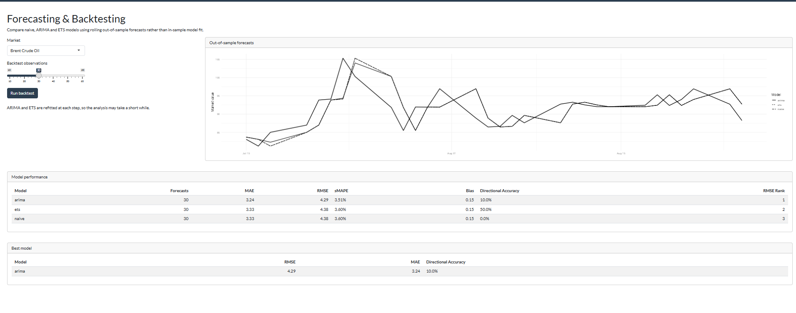
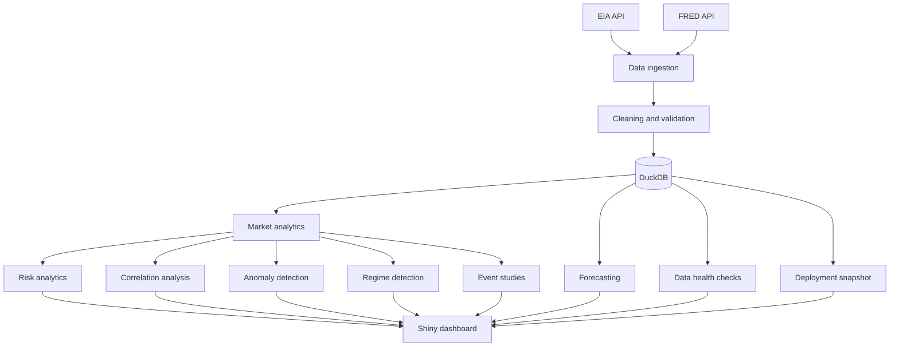

# EnergyQuant

[](https://github.com/rlev05/energyquant/actions/workflows/r-tests.yml)

**Live dashboard:** [Open EnergyQuant](https://ryanlevitt05.shinyapps.io/energyquant/)

EnergyQuant is an R project I built to explore energy markets and practise building a larger data project from start to finish.

I wanted to do something beyond a normal analysis notebook, so the project gradually grew into a small market analytics platform. It collects data from APIs, stores it in DuckDB, runs different types of quantitative analysis and then displays the results through a Shiny dashboard.

The main focus is energy markets, although I also included some financial and economic series because I wanted to look at how they interact with oil and natural gas.

## Screenshots

### Market overview



### Market analytics


### Forecast backtesting



## What is included

The project currently tracks:

- Brent crude oil
- WTI crude oil
- Henry Hub natural gas
- S&P 500
- Nominal Broad U.S. Dollar Index
- Federal Funds Effective Rate

The energy data comes from the U.S. Energy Information Administration (EIA), while the financial and economic data comes from FRED.

The data is stored in DuckDB and used for the different analysis sections in the dashboard.

## Dashboard

The dashboard is split into nine sections.

### Overview

The overview page gives a quick look at the latest data available in the project.

It shows how many markets are being tracked, the latest observation date and the most recent values, returns and volatility figures.

### Markets

This page lets me choose an individual market and look at its historical value and rolling volatility.

This was also useful while developing the project because it gave me a quick way to check whether the data coming from the APIs looked sensible.

### Risk

The risk section compares the markets using several common risk and performance measures.

These currently include:

- annualised return
- annualised volatility
- downside deviation
- historical Value at Risk
- Expected Shortfall
- maximum drawdown
- Sharpe ratio
- Sortino ratio
- Calmar ratio

I use the Federal Funds Effective Rate as the risk-free rate for the risk-adjusted measures.

### Relationships

I added this section because I wanted to look at more than each market individually.

It contains a full return correlation matrix and also lets me select two markets and calculate their rolling correlation.

For example, I can compare Brent with WTI, or look at whether the relationship between oil, equities and the dollar has changed over time.

### Anomalies

The anomaly section looks for daily returns which are unusually large compared with the market's recent history.

I used a rolling z-score for this.

An important part of the implementation was making sure the calculation only used observations that were available before the point being tested. Otherwise it would introduce look-ahead bias.

The dashboard shows how many anomalies were found, their direction and the dates where the largest unusual movements occurred.

### Volatility regimes

The regime section classifies each market as being in a low, normal or high volatility environment.

The thresholds are based on the market's own historical rolling volatility rather than using the same fixed thresholds for every market.

I also track changes between regimes, which makes it possible to see when a market moves into or out of a high-volatility period.

### Forecasting

For forecasting, I compare three approaches:

- naive
- ARIMA
- ETS

I did not want to choose a model just because it looked more complicated, so I kept a naive forecast as the baseline.

The models are tested using rolling one-step-ahead backtesting. This means the model is trained on historical data and tested on an observation it has not already seen.

I compare the models using:

- MAE
- RMSE
- sMAPE
- bias
- directional accuracy

One thing I liked about this part of the project was that it made it very obvious that a more complicated model is not automatically a better forecast.

### Event studies

The event-study page lets me choose a historical date and look at how the different markets behaved around it.

I can change the size of the window before and after the event and compare:

- pre-event return
- event-day return
- post-event return
- return over the complete event window

If the selected date is not a trading day, the study uses the next available market observation.

### Data health

I ended up checking the underlying data quite a lot while building the project, so I decided to make some of those checks part of the dashboard itself.

The Data Health page checks things such as:

- latest observation date
- missing values
- non-finite values
- duplicate dates
- stale series
- general validation status

This was useful because it stopped me treating the API data as if it was automatically correct just because it had downloaded successfully.

## A problem I ran into with WTI

One of the more interesting problems I came across was the negative WTI oil price in April 2020.

My original return calculation assumed prices were positive, which caused problems when calculating percentage and log returns around the negative observation.

Rather than removing the historical price, I changed the return calculation so that a return is only calculated when both the current and previous prices are positive.

That also stopped the unusual WTI value from producing invalid values in later calculations such as correlations and volatility.

It was a useful reminder that real market data can break assumptions that seem completely reasonable when first writing the code.

## Project architecture



## Data refresh

At first it would have been easiest to download the full history every time I ran the project, but that seemed unnecessary once the database already contained most of the data.

I therefore added an incremental refresh process.

```text
Latest observation in DuckDB
            |
            v
       Move back 7 days
            |
            v
 Request recent EIA/FRED data
            |
            v
 Standardise observations
            |
            v
       Upsert to DuckDB
            |
            v
    Run quality checks
```

I deliberately move the start date back by seven days instead of requesting only dates newer than the database.

This gives the APIs a small overlap where recently revised observations can be downloaded again.

Because the database uses upserts, running the refresh more than once does not create duplicate observations.

## Deployment data

The local version of EnergyQuant uses DuckDB.

For the hosted dashboard I also generate an RDS snapshot containing the observations needed by the application.

This means the public dashboard does not need my API keys and does not have to contact the EIA or FRED every time somebody opens it.

The API pipeline and incremental refresh code are still part of the repository, but the hosted application can fall back to the snapshot when the local database is unavailable.

## Technologies

The project is mainly written in R.

The main packages and tools I used are:

- Shiny and bslib for the dashboard
- ggplot2 for charts
- dplyr and the rest of the tidyverse for data manipulation
- httr2 for API requests
- DuckDB and DBI for storage
- forecast for ARIMA and ETS models
- testthat for automated tests
- renv for reproducible package versions
- GitHub Actions for continuous integration
- Git and GitHub for version control

## Data sources

### EIA

The U.S. Energy Information Administration API provides:

- Brent crude oil
- WTI crude oil
- Henry Hub natural gas

### FRED

Federal Reserve Economic Data provides:

- S&P 500
- Nominal Broad U.S. Dollar Index
- Federal Funds Effective Rate

The API keys are read from environment variables and are not committed to GitHub.

## Running the project locally

The repository uses `renv` to keep the R package environment reproducible.

Clone the repository and restore the packages with:

```r
renv::restore()
```

Create a `.env` file using `.env.example` as a starting point:

```text
EIA_API_KEY=
FRED_API_KEY=
ENERGYQUANT_DB_PATH=data/energyquant.duckdb
```

To download new observations and update the local database:

```bash
Rscript scripts/refresh_incremental_data.R
```

To run the data-quality checks:

```bash
Rscript scripts/check_data_quality.R
```

To run the automated tests:

```bash
Rscript tests/testthat.R
```

To start the dashboard:

```r
shiny::runApp(".")
```

## Testing and CI

As the project became larger, I added automated tests for areas where a small mistake could change a lot of later results.

The current tests cover things including:

- market return calculations
- negative price handling
- incremental refresh dates
- forecasting baselines
- event-study calculations

GitHub Actions runs the test suite automatically whenever code is pushed to `main` or included in a pull request.

I found this useful because it gives me a quick indication that a change has not broken one of the main calculations.

## Project structure

```text
energyquant/
├── .github/
│   └── workflows/
├── R/
├── analysis/
├── app/
├── data/
│   ├── deployment/
│   ├── processed/
│   └── raw/
├── docs/
│   └── screenshots/
├── scripts/
├── tests/
│   └── testthat/
├── app.R
├── DESCRIPTION
├── renv.lock
└── README.md
```

I kept most reusable functions inside `R/`.

The `scripts/` folder contains tasks that I normally run directly, such as updating market data, checking data quality and creating the deployment snapshot.

## What I learned

This was my first aim with the project: I wanted to get better at R by building something larger than a single analysis file.

A lot of the work ended up being around things I had not thought about at the start, such as making API refreshes repeatable, checking the data before analysing it, handling unusual historical observations and separating dashboard code from the underlying calculations.

I also got more experience with DuckDB, Shiny, time-series forecasting, `renv`, automated testing and GitHub Actions.

If I continued developing it, I would probably look at adding more commodity markets and portfolio-level analysis rather than adding lots of extra forecasting models straight away.

## Possible future work

Some things I may come back to are:

- more commodities and energy markets
- futures curve data
- portfolio risk analysis
- Monte Carlo scenarios
- another anomaly detection method to compare against the z-score approach
- scheduled cloud refreshes
- additional forecast models where they add a useful comparison

For now, I wanted to stop at a point where the existing parts are working together properly rather than adding features just to make the project larger.

## Disclaimer

I built EnergyQuant as a learning and portfolio project.

It is not intended to provide investment advice or trading recommendations.